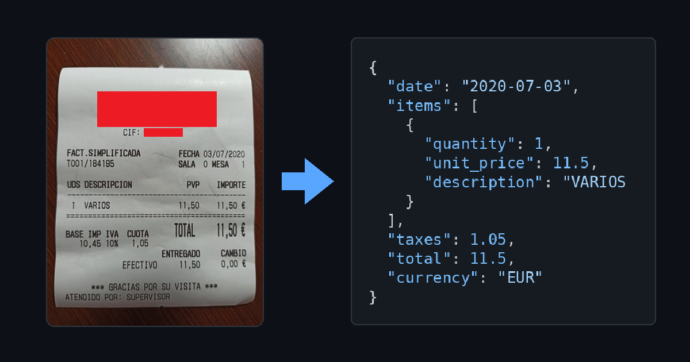

<h1 align="center">Document Extractor</h1>
<p align="center">
  Turn any image with structured data on it into validated JSON — you define what to extract.
</p>

<p align="center">
  
  
  
</p>

<p align="center">
  <a href="#features">Features</a> &nbsp;|&nbsp;
  <a href="#quick-start">Quick start</a> &nbsp;|&nbsp;
  <a href="#usage">Usage</a> &nbsp;|&nbsp;
  <a href="#configuration">Configuration</a>
</p>

<br>

<p align="center">
  
  <br>
  <sub>A photo in, validated structured JSON out.</sub>
</p>

## About

Document Extractor is a self-hosted microservice (+ web UI) that turns a
photo of **anything with structured data on it** into clean, validated JSON.
There's no fixed notion of "document type" baked in — you describe the
fields you care about, point the pipeline at one or more vision LLMs, and it
does the OCR-and-structuring work you'd otherwise hand-code per image type.

Tickets and invoices ship as ready-made example schemas so there's something
to try the moment it's running, but they're just that — examples. The same
pipeline extracts whatever fields matter to you from whatever kind of image
you throw at it: ID documents, shipping labels, forms, product packaging,
anything.

Where it earns its keep over "just call a vision model yourself": it can call
**more than one** model for the same image and only accept the result if
they agree, catches invalid output before it ever reaches your database, and
gives non-technical teammates a way to define new document types without
writing a line of JSON.

## Features

- **Multi-model cross-check** — run any image through more than one vision
  model at once; results are compared field by field and only accepted if
  they agree above a configurable threshold. A single model hallucinating a
  value doesn't silently make it into your data.
- **Visual schema builder** — define what to extract (fields, types,
  required-ness, nested lists and groups) by clicking, or drop into raw JSON
  Schema when you need something the builder doesn't cover. Both views stay
  in sync, and every schema is validated before it can be saved.
- **Schema versioning** — every save creates a new version instead of
  overwriting the last one; old versions and the extractions made against
  them stay intact.
- **Result caching** — the same image (matched by a SHA-256 hash) against
  the same schema version returns the cached result instantly, no LLM calls
  made. Toggle it off with `CACHE_ENABLED=false` if you always want fresh
  calls.
- **Full audit trail** — every extraction (models used/dropped, timing,
  pass/fail) is logged and queryable via `/v1/extraction-logs`.
- **Pluggable providers** — Azure OpenAI and Gemini today; adding another
  vision provider means implementing one port interface, not touching the
  pipeline.
- **Zero-setup database** — `docker compose up` gets Postgres, the API, and
  the UI running with the schema and two starter templates (ticket, invoice)
  already loaded. No migration step, nothing to run by hand — replace or
  delete the starter templates whenever you define your own.

## Supported providers

Models are configured as a JSON list in `LLM_MODELS` (see `.env.example` for
the fully commented version) — one self-contained entry per model
connection, each with its own credentials:

| Provider | Required fields |
|---|---|
| `azure` (Azure OpenAI) | `apiKey`, `endpoint`, `apiVersion`, `deployment` |
| `openai` (OpenAI directly) | `apiKey`, `model` |
| `gemini` (Google Gemini) | `apiKey`, `model` |

```json
[
  { "id": "azure-primary", "provider": "azure", "apiKey": "...", "endpoint": "https://...openai.azure.com", "apiVersion": "2024-10-21", "deployment": "gpt-4o-prod" },
  { "id": "openai-gpt4o",  "provider": "openai", "apiKey": "...", "model": "gpt-4o" }
]
```

`EXTRACTION_MODELS` then picks which of those `id`s run (and in what order —
it's the tie-break when models disagree). Because each entry has its own
credentials, nothing ties two entries of the same provider together: list as
many Azure deployments, OpenAI models, or Gemini models as you want, from
different resources/regions if needed, and cross-check across all of them.

Providers are just implementations of one port interface
(`LLMVisionProviderPort`) — the extraction pipeline only talks to that
interface, never to a specific SDK. Wiring up another vision model means
adding an adapter that implements it, not touching how extraction works.

## Quick Start

Requires [Docker](https://www.docker.com/) + Docker Compose.

```bash
git clone https://github.com/RobertoTM03/rtm-image-parser.git
cd rtm-image-parser
cp .env.example .env
# fill in the credentials for each model in LLM_MODELS, then list the ones
# you want active in EXTRACTION_MODELS

docker compose up -d --build
```

That's it — no separate migration step. Postgres creates the full schema and
seeds two starter templates (`ticket`, `factura`) automatically the first
time it initializes.

- UI: [http://localhost:5173](http://localhost:5173)
- API: [http://localhost:3000](http://localhost:3000)

```bash
curl http://localhost:3000/health
curl http://localhost:3000/v1/templates
```

Prefer running the API on the host (with Postgres in Docker) for
development?

```bash
npm install
cp .env.example .env   # DATABASE_URL here should point at localhost:5432
docker compose up -d db
npm run dev
```

## Usage

The examples below use the HTTP API directly. For quick manual testing
without writing `curl` commands, the bundled UI at
[http://localhost:5173](http://localhost:5173) wraps the same endpoints in
plain forms — upload an image, pick a document type, see the result. It's a
testing convenience, not a production dashboard; since it's just the `ui`
service in `docker-compose.yml`, drop it (or run `docker compose up -d db
api`) if you don't want it running.

### Extract a document

`document_type` is just the name of a schema you've registered — `ticket`
here is one of the two examples that ship by default, not a hardcoded
concept. Any image, matched to any schema you've defined, works the same way.

```bash
curl -X POST http://localhost:3000/v1/extract \
  -F "image=@receipt.jpg" \
  -F "document_type=ticket"
```

```json
{
  "data": { "merchant": "Acme", "total": 42.5, "currency": "EUR" },
  "metadata": {
    "modelsUsed": ["azure-gpt-4o", "gemini-1.5-pro"],
    "modelsDropped": [],
    "missingFields": [],
    "processingTimeMs": 842,
    "schemaVersion": 1,
    "cached": false
  }
}
```

`data` always has every field the schema declares — a field no model could
find comes back as `null` rather than being dropped from the JSON, and is
listed in `metadata.missingFields`. If that field is also in the schema's
`required` list, the extraction is rejected outright: a **422** with the
specific fields that are missing, alongside the same `null`-filled `data` for
inspection:

```json
{
  "error": "missing_required_fields",
  "data": { "merchant": "Acme", "total": null, "currency": "EUR" },
  "missingFields": ["total"],
  "metadata": { "modelsUsed": ["azure-gpt-4o"], "modelsDropped": [], "missingFields": ["total"], "processingTimeMs": 512, "schemaVersion": 1, "cached": false }
}
```

A JSON body (`imageBase64` + `mimeType` + `documentType`) works too. If the
configured models disagree beyond `CROSSCHECK_THRESHOLD`, you also get a
**422**, but with the specific field mismatches instead of a guessed answer:

```json
{
  "error": "crosscheck_discordant",
  "matchRatio": 0.5,
  "mismatches": [
    { "field": "total", "kind": "value_mismatch", "values": { "azure-gpt-4o": 42.5, "gemini-1.5-pro": 45.0 } }
  ]
}
```

### Define what to extract

Either through the UI's visual builder (see screenshot above) or directly:

```bash
curl -X POST http://localhost:3000/v1/schemas \
  -H "Content-Type: application/json" \
  -d '{
    "documentType": "delivery-note",
    "schema": {
      "type": "object",
      "required": ["reference", "date"],
      "properties": {
        "reference": { "type": "string" },
        "date": { "type": "string", "format": "date" }
      }
    },
    "fieldHints": { "reference": "Delivery note reference number, top-right of the document" }
  }'
```

```
GET    /v1/templates                     # starter templates to base a schema on
POST   /v1/schemas                       { documentType, basedOnTemplate?, schema?, fieldHints? }
GET    /v1/schemas/:document_type
PUT    /v1/schemas/:document_type        { schema?, fieldHints? }   # new version, never overwrites
GET    /v1/schemas/:document_type/versions
GET    /v1/extraction-logs               ?limit=&offset=   # paginated, capped by MAX_HISTORY_PAGE_SIZE
```

## Configuration

Copy `.env.example` to `.env` and fill in values:

| Variable | Required when | Notes |
|---|---|---|
| `LLM_MODELS` | always | JSON array of model connections (id, provider, credentials) — see [Supported providers](#supported-providers) and the commented example in `.env.example`. |
| `EXTRACTION_MODELS` | always | Comma-separated `LLM_MODELS` ids to actually use, in order (order is the tie-break when models disagree). An id missing from `LLM_MODELS` is skipped with a warning; if none resolve, the service refuses to start. |
| `CROSSCHECK_THRESHOLD` | defaults to `0.9` | Minimum fraction of matching fields for a multi-model result to be accepted. |
| `CROSSCHECK_NUMERIC_TOLERANCE` | defaults to `0.01` | Relative tolerance when comparing numeric fields across models. |
| `MAX_RETRIES_PER_MODEL` | defaults to `2` | Retries per model when its output fails schema validation. |
| `LLM_REQUEST_TIMEOUT_MS` | defaults to `30000` | Per-request timeout for LLM provider calls. |
| `MAX_IMAGE_SIZE_MB` | defaults to `10` | |
| `ALLOWED_MIME_TYPES` | defaults to `image/jpeg,image/png,image/webp` | |
| `CACHE_ENABLED` | defaults to `true` | Set to `false` to skip the by-image-hash (SHA-256) result cache and always call the LLMs. |
| `MAX_HISTORY_PAGE_SIZE` | defaults to `50` | Upper bound on `limit` for paginated `GET /v1/extraction-logs` requests. |
| `DATABASE_URL` | always | |
| `PORT` | defaults to `3000` | |
| `POSTGRES_USER`, `POSTGRES_PASSWORD`, `POSTGRES_DB` | used by `docker-compose.yml` to provision `db` | |

## Development

```bash
npm test          # unit + integration tests (integration tests need `docker compose up -d db`)
npm run typecheck
```

Under the hood this is a hexagonal (ports & adapters) service — the domain
layer has zero imports of Fastify, Postgres, ajv, or any LLM SDK, so swapping
a provider or the database is an adapter change, not a rewrite.

## Known limitations

- **No authentication** — not implemented yet.
  `src/adapters/http/plugins/auth.placeholder.ts` is a no-op hook already
  wired into every route, ready for a real check to be dropped in.
- **No schema import/export** — the visual builder covers most JSON Schema
  shapes (nested objects, lists, formats, enums); anything more exotic
  (`oneOf`, `$ref`, patterns) needs the raw JSON editor.

## Authors

**Roberto Tejero Martín** — design and development

## License

[MIT](./LICENSE)

## AI Disclosure

This project was developed using [Claude Code](https://claude.com/claude-code) as a programming assistant.
